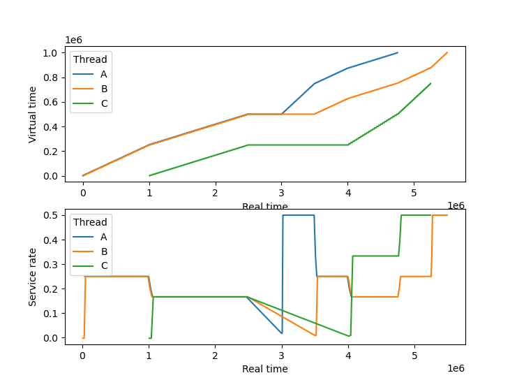
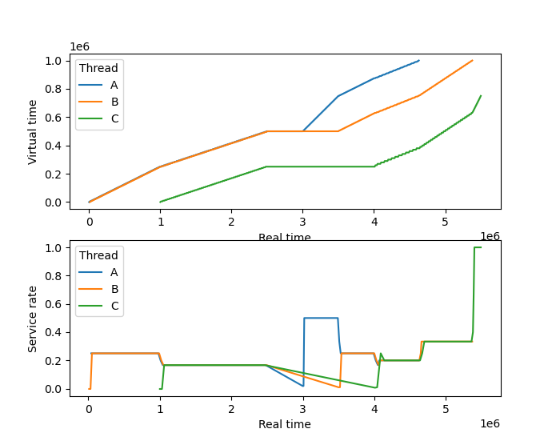

# Pragmatic CPU scheduling simulator

This repository hosts a pragmatic script for evaluating different CPU scheduling
schemes w.r.t. latency and fairness.

## Usage

A simulation is started with the following command line:

```
./schedule.py [--policy (rr|stride|base-hw)] [--plot_latencies] <input-file>
```

The script outputs the scheduling trace on the terminal and shows a plot for
visualisation (see Example).


## Input files

The script takes a single input file that describes the to-be-scheduled workload
as tab-separated values. Each row represents a single job. Note that the jobs
are processed sequentially so that they must be sorted by arrival time.

The input file has the following mandatory columns:

- `thread`: The name of the corresponding thread. This is used for evaluation and for
  tracking thread-specific attributes (e.g. quota, virtual time).
- `start`: The arrival time (e.g. `0.5s`, `500ms`, `1s50us`) or the period of the job
  (e.g. `every 50ms`). Alternatively to providing a time or period, you may
  provide an event name as a start condition.
- `runtime`: The time the job needs to run in order to complete.
- `weight`: The job's weight.


In addition, the following optional columns are supported:

- `priority`: The job's priority. Higher values indicate higher priority.
- `restart`: The time interval after which the job is restarted (after its completion).
- `event`: The name of the event that is triggerd after the job's completion.

## Example

Let's look at a simple example...

```
./schedule.py --policy rr input/example_simple.tsv
```

The workload in this example consists of 3 threads with two jobs each. All
jobs have weight 2 except the last job of thread C have weight 2, which has
weight 1.

The resulting plots are shown in the figure below.



The top plot depicts the virtual execution time of each thread
(executed time / weight) over real time. Jobs with equal weight should have
the same slope.

The bottom plot depicts the slope of each thread's virtual execution time. Note
that this is calculated over a window of two consecutive executions, which leads
to artifacts when a thread sleeps.

In this example, we see that round robin scheduling does not consider weights,
hence the second activation of thread C (at 4s) receives more virtual execution
time than thread B.

The difference becomes clear, when we simulate the same example with stride
scheduling:

```
./schedule.py --policy stride input/example_simple.tsv
```


